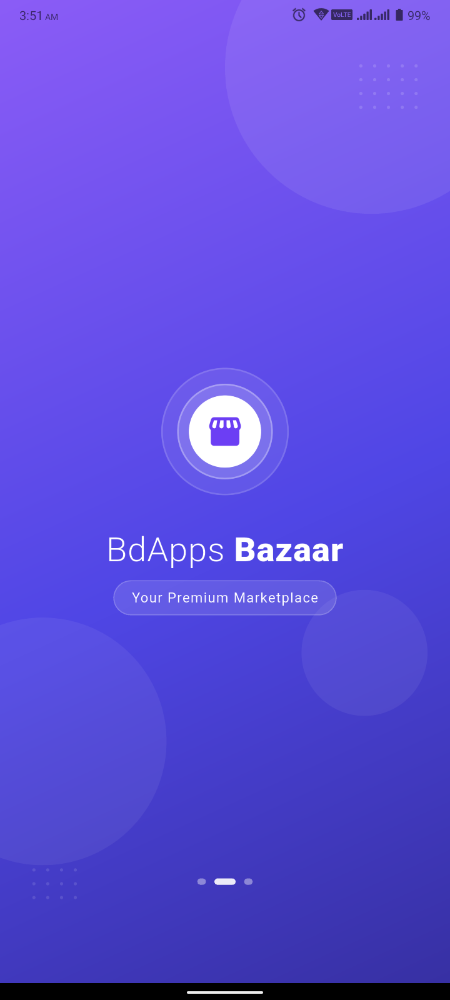
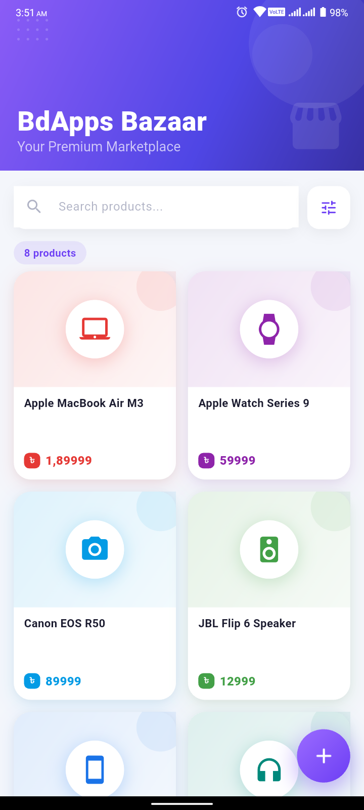
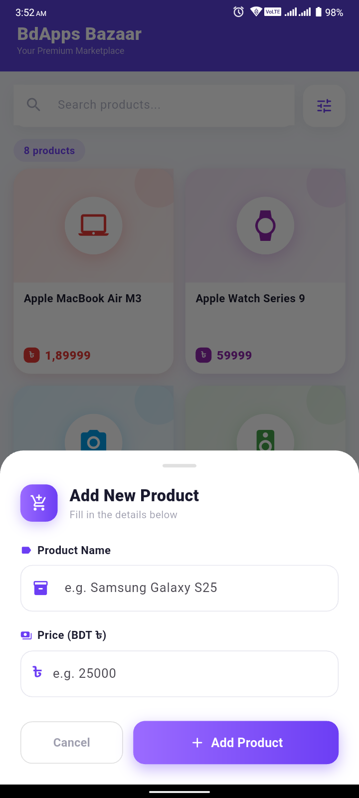

<div align="center">

# 🛍️ BdApps Bazaar

**A modern, premium Flutter e-commerce product list app**

*Built for the bdapps National Android Development Bootcamp 2026*
*Module 1 — Dart Foundations · 2nd Online Class Assignment*

---


</div>

---

## 📸 App Screenshots

<div align="center">
  <table>
    <tr>
      <td align="center" width="33%">
        <kbd><b>🌟 Splash Screen</b></kbd><br><br>
        
      </td>
      <td align="center" width="33%">
        <kbd><b>🛒 Home Screen</b></kbd><br><br>
        
      </td>
      <td align="center" width="33%">
        <kbd><b>➕ Add Product Sheet</b></kbd><br><br>
        
      </td>
    </tr>
  </table>
</div>

---

## 📌 About the Project

**BdApps Bazaar** is a single-screen Flutter shopping app built as an assignment for the **bdapps National Android Development Bootcamp 2026**. The app demonstrates core Flutter and Dart fundamentals including UI building, state management, and Dart collections.

The project showcases how to build a clean, production-quality mobile UI using only Flutter's built-in tools — no external state management libraries, no backend, no database. Everything is local, simple, and beginner-friendly.

---

## ✨ Features at a Glance

| Feature               | Details                                                                |
|-----------------------|------------------------------------------------------------------------|
| 🛒 **Product Grid**   | Responsive 2-column card layout with staggered animations              |
| ➕ **Add Product**     | Animated bottom sheet form with full input validation                  |
| 🔍 **Live Search**    | Instantly filters products by name as you type                         |
| 📊 **Smart Sort**     | Sort by Name A→Z / Z→A or Price Low→High / High→Low                    |
| 🗺️ **Map Structure** | `List<Map<String, dynamic>>` used throughout (assignment requirement)  |
| 💬 **Snackbar**       | Visual confirmation shown after every product is added                 |
| 🖼️ **Empty State**   | Beautiful illustration for no products / no search results             |
| 🌟 **Splash Screen**  | Animated gradient splash on app launch                                 |
| ⚡ **Performance**     | `RepaintBoundary`, `ClampingScrollPhysics`, `const` widgets throughout |

---

## 🗂️ Project Structure

```
bdapps_bazaar/
│
├── lib/
│   ├── main.dart                   ← App entry point, MaterialApp, global theme
│   ├── splash_screen.dart          ← Animated launch splash screen
│   ├── home_screen.dart            ← Main screen: grid, search, sort, FAB
│   ├── product_data.dart           ← List<Map<String,dynamic>> data + helpers
│   │
│   └── widgets/
│       ├── product_card.dart       ← Individual product card with animations
│       ├── add_product_sheet.dart  ← Bottom sheet form for adding products
│       ├── sort_menu.dart          ← Popup sort menu + SortMode constants
│       └── empty_state.dart        ← Empty / no-results UI illustration
│
├── pubspec.yaml                    ← Project dependencies
├── analysis_options.yaml           ← Linting rules
└── README.md                       ← You are here
```

---

## 🗃️ Map Data Structure (Assignment Requirement)

This project uses Dart `Map` objects stored inside a `List` to manage all product data — as required by the assignment brief:

```dart
// product_data.dart
List<Map<String, dynamic>> products = [
  {
    "name":  "iPhone 15 Pro",
    "price": 149999.0,
    "icon":  Icons.phone_iphone,
    "color": Color(0xFF6C3EF4),
  },
  {
    "name":  "Samsung Galaxy S24",
    "price": 119999.0,
    "icon":  Icons.smartphone,
    "color": Color(0xFF1A73E8),
  },
  // ... more products
];
```

All operations — **adding**, **searching**, and **sorting** — work directly on this `List<Map<String, dynamic>>` without any external packages or databases.

---

## 🎨 UI & Design Highlights

- **Material 3** design system with a deep purple / indigo theme
- **Gradient SliverAppBar** that collapses and stretches on scroll
- **Per-card accent colours** — each product has its own colour identity
- **Animated splash screen** with logo scale, title slide, and tagline fade
- **Staggered card animations** — cards fade and slide in sequentially
- **FAB press feedback** — scale-down micro-interaction on tap
- **Animated bottom sheet** with slide + fade entrance
- **BDT ৳ currency formatting** in South Asian comma style (e.g. `1,49,999`)
- **Responsive layout** works on all screen sizes

---

## ⚡ Performance Choices

| Technique                                                       | Why                                                    |
|-----------------------------------------------------------------|--------------------------------------------------------|
| `RepaintBoundary` on each card                                  | Isolates card repaints from the rest of the UI         |
| `ClampingScrollPhysics`                                         | Snappier scroll on Android vs bouncing                 |
| `AnimatedOpacity` + `AnimatedSlide`                             | Native flutter animations, no extra controllers        |
| Extracted sub-widgets (`_SearchBar`, `_AppBarBackground`, etc.) | Only the changed widget rebuilds, not the whole screen |
| `const` constructors everywhere possible                        | Widgets skipped entirely during rebuilds               |
| `InkSparkle.splashFactory`                                      | GPU-accelerated ripple effect                          |
| `withValues(alpha:)` over `withOpacity()`                       | Avoids deprecated color allocation per frame           |

---

## 🚀 Getting Started

### Prerequisites

- Flutter SDK **≥ 3.0** — [Install Flutter](https://flutter.dev/get-started)
- Dart SDK **≥ 3.0** (included with Flutter)
- Android Emulator or physical device

### Run the App

```bash
# Step 1 — Navigate into the project folder
cd bdapps_bazaar

# Step 2 — Install dependencies
flutter pub get

# Step 3 — Run on connected device or emulator
flutter run
```

**Targeting a specific device:**
```bash
flutter devices                   # list all available devices
flutter run -d <device_id>        # run on the selected device
```

**Build a release APK:**
```bash
flutter build apk --release
```

---

## 🧠 Technologies Used

| Technology              | Purpose                                       |
|-------------------------|-----------------------------------------------|
| **Flutter**             | UI framework                                  |
| **Dart**                | Programming language                          |
| **Material 3**          | Design system                                 |
| **StatefulWidget**      | Local state management                        |
| **List & Map**          | Data structures (assignment core requirement) |
| **SliverAppBar**        | Collapsible, stretchable app bar              |
| **ModalBottomSheet**    | Add product form                              |
| **AnimationController** | Splash screen sequences                       |

---

## 🎯 Assignment Details

| Field           | Info                                              |
|-----------------|---------------------------------------------------|
| **Program**     | bdapps National Android Development Bootcamp 2026 |
| **Batch**       | Batch 1                                           |
| **Module**      | Module 1 — Dart Foundations                       |
| **Assignment**  | 2nd Online Class Assignment                       |
| **Topic**       | Dart Map Data Structure + Flutter UI              |
| **Requirement** | Use `List<Map<String, dynamic>>` for product data |

---

## 🏛️ About the Bootcamp

The **National Android Development Bootcamp (NADB) 2026** is a nationwide initiative by **bdapps** focused on growing Bangladesh's mobile developer community. The program covers:

- Flutter & Dart fundamentals
- Android app development
- App monetization strategies
- Real-world project building
- Developer community growth

---

## 👨‍💻 Developer

<div align="center">

### Md Shahajalal Mahmud
**Android & Backend Developer · Founder @ Appriyo**

*Building one app at a time 🚀*

</div>

---

## 💙 Acknowledgements

Special thanks to the **NADB Mentors & Organizers** for creating such an incredible structured learning opportunity for Bangladeshi developers. This bootcamp is genuinely changing the landscape of mobile development in Bangladesh.

---

## ⭐ Final Note

This project marks the beginning of my structured Flutter journey through the NADB 2026 bootcamp. As the program progresses, more advanced modules, projects, and features will be explored and documented here.

*If this project helped you understand Flutter basics, drop a ⭐ on the repo!*

---

<div align="center">

📜 **License** — Created for educational and assignment purposes · NADB 2026

</div>